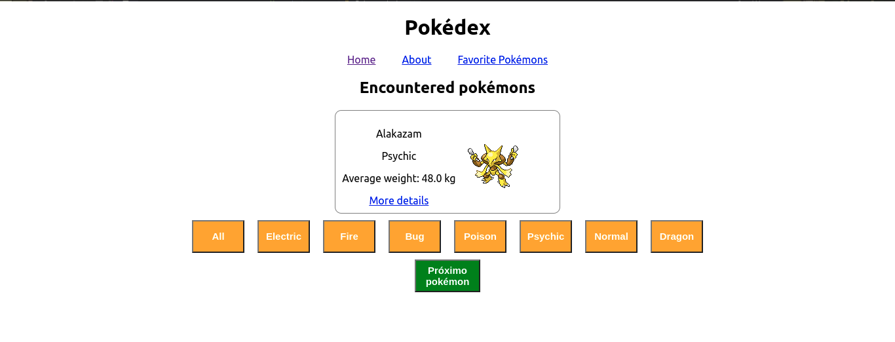

# Sobre o Projeto:

Página em react que consome a [PokéAPI](https://pokeapi.co/)  que apresenta alguns pokémons do universo de pokémon e apresenta seus detalhes, também é possível favoritar pokémons.

# Quer rodar o App?
https://emmanoel1-react-testing-library.pages.dev/

# Instruções para rodar o projeto localmente e os testes:

1. Clone o repositório
  * `git clone git@github.com:emmanoel1/react-testing-library.git`
  
  * Entre na pasta do repositório que você acabou de clonar:
    * `cd react-testing-library`

2. Instale as dependências
  * `npm install`
  
3. Rode o Projeto Testado
  * `npm start`

4. Para Rodar um teste específico
  * `npm test {nome do teste}`
    * exemplo `npm test about`
  * Lista com todos os testes:
    * `about`
    * `app`
    * `favoritepokemons`
    * `notfound`
    * `pokedex`
    * `pokemon`
  

5. Para rodar todos testes e calcular a média de aprovação
  * `npm run test-coverage`
